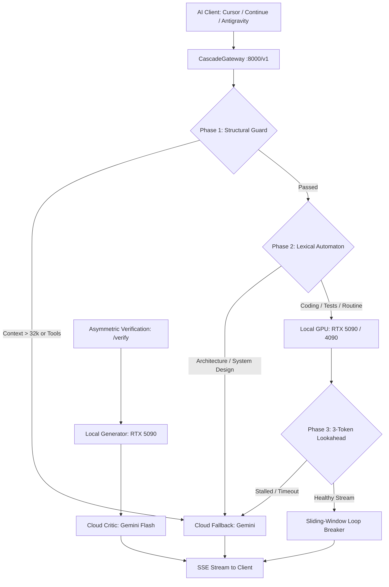
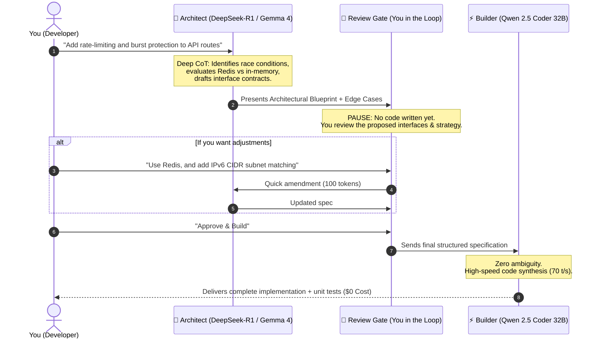

# CascadeGateway ⚡
### Hardware-Adaptive Local LLM & Cloud Cascading Architecture

[](https://opensource.org/licenses/MIT)
[](https://python.org)
[](https://ollama.com)
[](https://platform.openai.com)
[](https://modelcontextprotocol.io)

**CascadeGateway** is an intelligent, hardware-adaptive cascading proxy that routes AI queries between local GPUs (via Ollama at **$0 token cost**) and frontier cloud models (Google Gemini, OpenAI, etc.). 

It automatically detects your GPU hardware and physical VRAM on startup—whether running a flagship **RTX 5090 (32GB)**, **RTX 4090 (24GB)**, mainstream **RTX 3080 (10GB)**, or Apple Silicon—and dynamically selects and sizes the optimal models without requiring manual reconfiguration.



---

## 🚀 Key Features

* **Hardware-Adaptive VRAM Sizing**: Automatically profiles your GPU (`nvidia-smi` / Metal / CPU) and assigns the optimal model tier.
* **Autonomous $0 Offload**: Resolves 85–95% of routine coding, unit tests, refactoring, and QA directly on local VRAM.
* **Dynamic Token Biasing Engine**:
  * **Adaptive Mode**: Automatically increases local GPU bias as cloud token budgets get consumed.
  * **Manual Slider**: Fine-tune local preference from 0% (Quality First) to 100% (Maximum Local Offload).
  * **Strict Local**: 100% execution on local VRAM with automatic cloud overflow only if context exceeds physical limit.
* **🧠 Multi-Task Workflow Modes & Interactive Review Gate**:
  * **🧠 Architect & Builder**: Reasoning model drafts architecture, data contracts, and edge cases $\rightarrow$ Pauses at a **Human Review Gate** $\rightarrow$ You approve or refine $\rightarrow$ Builder synthesizes production code.
  * **🚀 Solo Sprint**: Instant local coding via `qwen2.5-coder:32b` for quick functions, tests, and scripts.
  * **🌐 Deep Context**: Gemini 2.5 Flash ingests massive repository files (1M context) $\rightarrow$ modular execution on local 5090.
  * **🔬 Math & Algo Proof**: Deep Chain-of-Thought formal verification for cryptography and concurrency algorithms.
  * **🛡️ Asymmetric Verification (`/verify`)**: High-speed local draft synthesis on RTX 5090 ($0) combined with an anonymous strict cloud auditor (Gemini) providing production-grade critique and code enhancement without leaking full history.
* **🛡️ Sub-5ms Intelligent Routing & 3-Token Lookahead Failover**: Three-phase classification pipeline: Phase 1 Structural & VRAM Budget Validation (<1ms, prevents swapping to system RAM), Phase 2 Single-Pass Lexical Scan (<1ms), and Phase 3 Resilient Streaming with an in-memory 3-token lookahead buffer that transparently replays stalled local requests to Gemini Cloud without dropping client connections or throwing IDE error popups.
* **🔁 Anti-Hallucination Sliding-Window Loop Breaker**: In-flight ring buffer tracking token emission sequences (lengths 2, 3, 4 repeated $\ge 4\times$), terminating runaway generative loops immediately.
* **⚡ 1-Click IDE Auto-Configuration**: Automated zero-friction setup endpoint (`/api/ide/auto-config`) and UI button for VSCode Continue (`~/.continue/config.json`) and Cursor.
* **💰 Zero-Surprise Dollar Savings Telemetry**: Hardware-native token accounting (`eval_count`) calculating real-time dollar savings based on commercial frontier rates ($3.00/1M tokens).
* **⚡ Persistent GPU VRAM Residency & Zero-Cold-Start**: Models remain permanently resident in GPU VRAM (`keep_alive: -1`) across idle periods and tasks, ensuring instant zero-delay responses. Includes manual 1-Click **"Pause GPU"** (instant VRAM purge for AAA gaming) and **"Warm GPU"** (preloads weights into VRAM).
* **Native Model Context Protocol (MCP)**: Exposes a high-performance Streamable HTTP and Stdio MCP endpoint for **Google Antigravity** and **Claude Desktop**.
* **🎛️ Dynamic Model Selection**: Select any installed local model for both the **Architect** role (`deepseek-r1:14b`, `gemma4:26b`, etc.) and the **Builder** role (`qwen2.5-coder:32b`, etc.) directly from the Web UI toolbar or Windows Tray submenus. Automatically detects newly pulled models from Ollama without restarting the gateway.
* **Zero-Window Background Tray App**: Runs silently in the system tray, boots with Windows/Linux, and includes single-instance mutex protection.
* **🎮 1-Click Pause & Free GPU (Instant VRAM Purge)**: Evicts loaded models from VRAM in <1s via a dedicated button on the Web UI, Windows Tray, or `POST /api/models/unload`. Frees 20–30+ GB of VRAM immediately for AAA gaming, Blender, or video editing without terminating the server. Models reload automatically on demand when coding.
* **Live Hardware Telemetry**: In-browser control center showing real-time VRAM allocation, GPU power draw (W), temperature (°C), lifetime token savings, and an interactive prompt runner.
* **Standard OpenAI-Compatible API**: Seamless drop-in replacement (`/v1/chat/completions`) for Cursor, VSCode (Continue.dev), Aider, Claude Dev, and custom scripts.

---

## 🧠 The Interactive Review Gate



---

## 📊 VRAM Hardware Sizing Matrix

| Hardware Tier | Supported GPUs | VRAM | Recommended Coding Model | General / Reasoning | Expected Speed |
| :--- | :--- | :--- | :--- | :--- | :--- |
| **Tier 1 (Flagship)** | RTX 5090, 4090, 3090, A6000 | **24 GB – 32 GB** | `qwen2.5-coder:32b` | `gemma4:26b` / `deepseek-r1:32b` | **60 – 75+ tokens/sec** |
| **Tier 2 (Enthusiast)** | RTX 4080, 4070 Ti, 4070, 3080 12GB | **12 GB – 16 GB** | `qwen2.5-coder:14b` | `mistral-small:22b-q4` | **45 – 55+ tokens/sec** |
| **Tier 3 (Mainstream)** | RTX 3080 10GB, 3070, 4060 Ti, 2080 Ti | **8 GB – 10 GB** | `qwen2.5-coder:7b` | `llama3.1:8b` | **85 – 100+ tokens/sec** |
| **Tier 4 (Entry / CPU)** | RTX 3050, 4060 laptop, Apple Silicon, CPU | **< 8 GB** | `qwen2.5-coder:1.5b` / `3b` | `llama3.2:3b` | **40 – 70 tokens/sec** |

---

## ⚡ Quick Start

### Prerequisites
1. **[Ollama](https://ollama.com/)** installed and running on your machine.
2. **Python 3.10+** installed.
3. (Optional) A free API key from [Google AI Studio](https://aistudio.google.com/app/apikey) for cloud fallback.

### Windows (One-Click)
```cmd
git clone https://github.com/jadberro/CascadeGateway.git
cd CascadeGateway
scripts\setup.bat
```
*Creates `.venv`, installs dependencies, auto-generates your desktop shortcut, and places an auto-start shortcut in your Windows Startup menu.*

### Linux / macOS
```bash
git clone https://github.com/jadberro/CascadeGateway.git
cd CascadeGateway
chmod +x scripts/setup.sh
./scripts/setup.sh
```

---

## 🛠️ Connecting Your IDEs & Tools

Once running, the control center is available at **`http://127.0.0.1:8000/`**.

### 1. Google Antigravity
Add to `~/.gemini/config/mcp_config.json`:
```json
{
  "mcpServers": {
    "rtx5090-cascade": {
      "serverUrl": "http://127.0.0.1:8000/mcp"
    }
  }
}
```
*Antigravity automatically detects the toolset (`query_local_5090`, `cascade_llm`, `get_cascade_metrics`) and dynamically dispatches code generation directly to your GPU.*

### 2. Cursor
* Navigate to **Settings > Models > OpenAI API Key**.
* Set **Base URL**: `http://127.0.0.1:8000/v1`
* Set **API Key**: `cascading-local` (any string)
* Model: `cascade-auto`

### 3. Continue.dev (`config.json`)
```json
{
  "models": [
    {
      "title": "Cascade Gateway (Local + Cloud)",
      "provider": "openai",
      "model": "cascade-auto",
      "apiBase": "http://127.0.0.1:8000/v1",
      "apiKey": "cascading-local"
    }
  ],
  "tabAutocompleteModel": {
    "title": "Local Autocomplete",
    "provider": "openai",
    "model": "cascade-auto",
    "apiBase": "http://127.0.0.1:8000/v1",
    "apiKey": "cascading-local"
  }
}
```

### 4. Claude Desktop (`claude_desktop_config.json`)
```json
{
  "mcpServers": {
    "local-cascade": {
      "serverUrl": "http://127.0.0.1:8000/mcp"
    }
  }
}
```

### 5. Python OpenAI SDK
```python
from openai import OpenAI

client = OpenAI(
    base_url="http://127.0.0.1:8000/v1",
    api_key="cascading-local"
)

response = client.chat.completions.create(
    model="cascade-auto",
    messages=[
        {"role": "user", "content": "Write an optimized LRU cache in Python."}
    ]
)
print(response.choices[0].message.content)
```

---

## 📁 Repository Architecture

CascadeGateway is structured as a modern, modular Python package:

```text
CascadeGateway/
├── src/
│   └── cascadegateway/
│       ├── core/                  # Hardware profiler, model sizing & routing engine
│       │   ├── config.py          # YAML config & environment loader
│       │   ├── hardware.py        # GPU VRAM auto-profiling (5090/4090/etc.)
│       │   ├── classifier.py      # Phase 1 structural validation & Phase 2 regex automaton (<1ms)
│       │   ├── streaming.py       # Phase 3 lookahead failover, loop breaker & asymmetric audit
│       │   └── router.py          # Biasing engine, metrics & model resolution
│       ├── api/                   # Modular FastAPI endpoints
│       │   ├── server.py          # App initialization, SSE streaming & /v1/chat/completions
│       │   ├── pipeline.py        # Architect, Review Gate & Builder endpoints
│       │   └── models.py          # Pause & Free GPU (VRAM purge) & 1-click IDE auto-config
│       ├── web/                   # Clean decoupled web assets & responsive UI
│       │   ├── templates/
│       │   │   └── dashboard.html # Responsive HTML5 dashboard & real-time telemetry
│       │   └── static/
│       │       ├── css/dashboard.css
│       │       └── js/dashboard.js
│       ├── tray/                  # Windows system tray background app
│       │   └── app.py             # System tray controls, VRAM pause & IDE auto-config
│       └── mcp/                   # Model Context Protocol stdio & HTTP server
│           └── server.py          # Antigravity & Claude Desktop integration
├── scripts/                       # Platform launchers & utilities
│   ├── start_cascade.bat          # Windows batch launcher
│   ├── start_tray.vbs             # Silent windowless tray runner
│   ├── setup.bat / setup.sh       # One-click installers
│   └── create_shortcuts.ps1       # Desktop & startup shortcut generator
├── tests/                         # Comprehensive automated test suites
│   ├── test_gateway.py            # End-to-end API integration tests
│   ├── test_resilience.py         # Sub-5ms SLA, structural validation & lookahead tests
│   └── test_new_features.py       # Loop breaker, IDE auto-config, dollar savings & /verify tests
├── assets/                        # Icons & diagrams
├── config.yaml                    # Gateway configuration
├── pyproject.toml                 # Modern pip/uv packaging metadata
└── requirements.txt
```

---

## 📡 API Reference

| Endpoint | Method | Description |
| :--- | :--- | :--- |
| `/v1/chat/completions` | `POST` | OpenAI-compatible chat completion endpoint supporting resilient SSE streaming, lookahead failover, loop breaking, and diagnostic headers (`X-Cascade-*`). |
| `/v1/models` | `GET` | Returns available virtual model aliases (`cascade-auto`, `local-5090`) and physical Ollama models. |
| `/api/hardware` | `GET` | Real-time GPU telemetry: VRAM allocation, temperature, power draw (W), and detected hardware tier. |
| `/api/models/unload` | `POST` | **Instant VRAM Purge ("Pause GPU")**: Evicts loaded models to 0 MB VRAM in <1s for AAA gaming or rendering. |
| `/api/models/preload` | `POST` | **Warm GPU**: Preloads and pins model into VRAM with indefinite residency (`keep_alive: -1`). |
| `/api/ide/auto-config` | `POST` | **1-Click IDE Setup**: Injects CascadeGateway configuration into `~/.continue/config.json` and detects Cursor environments. |
| `/api/workflow/mode` | `POST` | Sets active workflow mode (`architect`, `builder`, `solo`, `verify`, `deep_context`, `math`). |
| `/metrics` | `GET` | Telemetry: exact hardware token accounting (`eval_count`), local offload percentage, and real-time dollar savings. |
| `/mcp` | `POST` | Model Context Protocol streamable HTTP endpoint for Google Antigravity and Claude Desktop. |
| `/` | `GET` | Interactive browser control center, real-time hardware gauges, and prompt workbench. |

---

## ⚙️ Configuration (`config.yaml`)

```yaml
server:
  host: "127.0.0.1"
  port: 8000

local:
  provider: "ollama"
  base_url: "http://127.0.0.1:11434"
  # Set empty to let the hardware profiler auto-select the best model for your GPU
  primary_model: ""
  max_context_tokens: 32768
  timeout_seconds: 120

cloud:
  provider: "gemini"
  default_model: "gemini-2.5-flash"
  pro_model: "gemini-2.5-pro"
  max_context_tokens: 1048576

biasing:
  mode: "adaptive"        # "adaptive", "manual", or "local_only"
  bias_factor: 0.35       # Baseline local bias (0.0 to 1.0)
  cloud_token_budget: 500000
  allow_context_overflow_to_cloud: true
```

---

## 📜 License
This project is licensed under the [MIT License](LICENSE).
